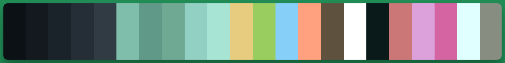
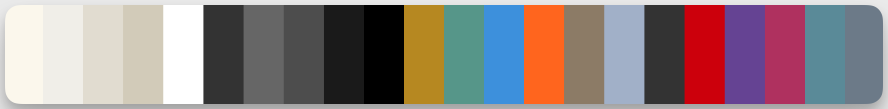
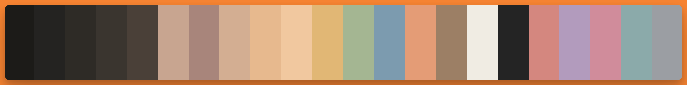
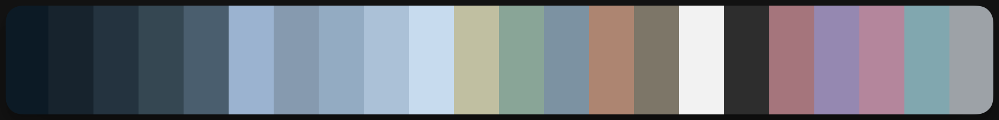

    
    <h2 align="center">Four Symbols Theme</h2>

The Four Celestial Beasts - the Azure Dragon, the White Tiger, the Vermilion Bird, and the Black Tortoise.

> [!CAUTION]
> This theme is currently in an unstable state. The color choices are largely based on my subjective preferences, and there may be significant changes in the future.

## Four Symbols Theme

The Four Emblems is a series of themes inspired by the four great mythological beasts of ancient China: the Azure Dragon, White Tiger, Vermilion Bird, and Black Tortoise. Each theme represents a season and an element, aiming to provide a unique visual experience for the audience.

- **Azure Dragon**: Represents the east and spring, symbolizing vitality and growth. This theme is characterized by green, azure, and bright colors.

- **White Tiger**: Represents the west and autumn, symbolizing strength and majesty. This theme is characterized by white and gray colors.

- **Vermilion Bird**: Represents the south and summer, symbolizing passion and vigor. This theme is characterized by red and orange colors.

- **Black Tortoise**: Represents the north and winter, symbolizing stability and coldness. This theme is characterized by black and blue colors.

## Palette
### Azure Dragon - 青龙

### White Tiger - 白虎

### Vermilion Bird - 朱雀

### Black Tortoise - 玄武

# Ports
* [Neovim](https://github.com/four-symbols/four-symbols.nvim)
* [Tmux](https://github.com/four-symbols/four-symbols-tmux)
* [Kitty](https://github.com/four-symbols/kitty)